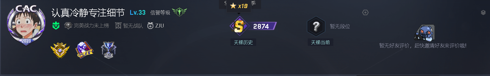

I believe:Bias result from cognitive constraints.\
I'm currently pursuing a PHD at college of seience and engineering , Zhejiang University, China.

#### Email
tangdaozhi@zju.edu.cn

#### Education
M.E., college of seience and engineering , China Zhejiang University, 2023—.\
B.E., Civil engineering , China Hunan University, 2018—2022.

#### Research Interests
OWT

#### Programming Skills
- Python(numpy\scipy\matplotlib\pandas\pytorch)
- Matlab
- C++
- fortran90

#### hobbies
- AI painting

- computer games

- Fitness